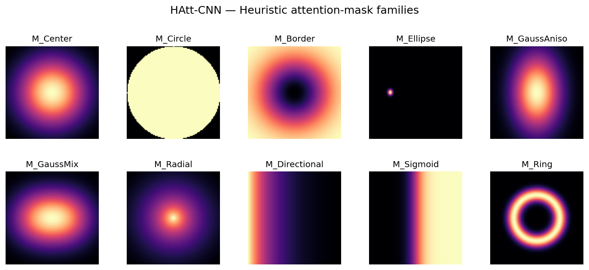

<div align="center">

# 🧠 HAtt-CNN

### Adaptive Visual-Attention Supervision with Heuristic Masks for Interpretable and Performant CNNs

[](https://www.python.org/)
[](https://pytorch.org/)
[](https://developer.nvidia.com/cuda-toolkit)
[](https://www.docker.com/)
[](LICENSE)
[](#-citation)
[](https://github.com/Millimono/HAtt-CNN/actions)

*Guide a CNN's attention toward relevant regions **during training**, without any manual annotation — improving accuracy, attention stability, and interpretability simultaneously.*

</div>

---

## 📋 Overview

Convolutional Neural Networks (CNNs) are highly accurate but remain **"black boxes"**, which limits their adoption in critical domains such as medical imaging. Post-hoc methods (Grad-CAM, Grad-CAM++, Score-CAM, Integrated Gradients, LIME) explain a decision *after* training, but are unstable and give no guarantee that the network actually relied on the relevant regions while learning.

**HAtt-CNN** introduces an **adaptive attention-supervision** scheme that sits between two extremes:

| Family | Needs annotations? | Strength | Weakness |
|---|---|---|---|
| Mask/box supervision (GAIN, BoxSup) | ✅ Yes | Reliable localization | Costly, hard to scale |
| Post-hoc CAM (Grad-CAM, CLAM, HaS) | ❌ No | Easy to deploy | Partial / unstable maps |
| Self-regularization (ABN, RRR) | ❌ No | Lightweight, stabilizing | No external prior |
| **HAtt-CNN (ours)** | ❌ **No (self-generated masks)** | **Temporal stability + performance gains** | — |

The key idea: a **heuristic target mask** combines a spatial prior with a **historical memory of Grad-CAM maps**, and supervises the attention through a differentiable loss that is jointly optimized with classification.

<div align="center">

<br><em>Adaptive attention supervision: heuristic prior + CAM memory → differentiable target mask.</em>
</div>

---

## ✨ Highlights

- **Annotation-free supervision** — heuristic masks evolve dynamically from a spatial prior + CAM history.
- **Performance *and* stability** — on MiniDDSM, **+1.23 accuracy points** while significantly reducing inter-epoch attention variance.
- **Dynamic target** — a temporally regularized attention target that grows in confidence as training progresses.
- **Progressive trust schedule** — the weight of the CAM memory ramps up gradually, avoiding an over-confident early bias.
- **Demonstrated adaptability** — validated across natural (CIFAR-10, Imagenette) and medical (MiniDDSM) domains.

---

## 📊 Key Results

Benchmarked with **ResNet-18** backbone across three datasets, against a no-attention-supervision baseline.

| Dataset | Best setting | Metric | Result |
|---|---|---|---|
| CIFAR-10 | `MCircle` + adaptive | comprehensiveness | **up to 0.83** |
| Imagenette | `MCircle` + adaptive | comprehensiveness | **up to 0.53** |
| MiniDDSM | `MBorder` / `MDiffuse` | accuracy | **0.8749** vs `0.8626` baseline (**+1.23 pts**) |
| MiniDDSM | dynamic supervision | attention stability | ↑ inter-epoch similarity, ↓ activation variance |

> Explainability is quantified with the **deletion**, **insertion**, **sufficiency**, and **comprehensiveness** metrics; classification with accuracy / precision / recall / F1 / AUC.

<div align="center">
<table>
<tr>
<td align="center"><br><em>Heuristic mask families</em></td>
<td align="center"><br><em>Baseline vs supervised Grad-CAM</em></td>
</tr>
<tr>
<td align="center"><br><em>Attention stability across epochs</em></td>
<td align="center"><br><em>Deletion / insertion curves</em></td>
</tr>
</table>
</div>

> 📌 The figures above are placeholders under `docs/figures/`. A generator script (`tools/make_mask_gallery.py`) produces the mask gallery directly from `MaskGenerator`; drop your trained-model figures in the same folder to complete the panel.

---

## 🧮 Method in a nutshell

**1. Differentiable Grad-CAM.** For target class *c*, channel weights are the spatial average of gradients, and the map keeps the computation graph so it can be back-propagated through:

```
α_k = GAP(∂y_c / ∂Aᵏ)
S    = Σ_k α_k · Aᵏ          (pre-ReLU)
CAM  = ReLU(S)
```

**2. Adaptive target mask.** A heuristic prior is blended with a running memory of past CAMs:

```
M_target = (1 − w) · M_heuristic + w · M_adaptive
M_adaptive = mean(CAM_history)        # temporal regularization
w = min(0.9, epoch / 10)              # progressive trust in the memory
```

**3. Joint objective.** Classification + attention supervision, with an optional epoch-dependent weight (dynamic regime):

```
L_total = L_CE + α_t · ‖CAM − M_target‖²
α_t = α_min + (α_max − α_min) · (epoch / total_epochs)   # dynamic
α_t = gradcam_loss_weight                                # fixed
```

### Mask families (`MaskGenerator`)

| Category | Types |
|---|---|
| **Headline (paper)** | `center`, `circle`, `border`, `diffuse` |
| Anatomical (mammography) | `ellipse`, `tissue` (Otsu-driven) |
| Parametric priors | `gaussian_anisotropic`, `gaussian_mixture`, `radial`, `directional`, `sigmoid`, `ring` |
| Learned | `latent` |

---

## 📦 Installation

### Option A — Docker (recommended, fully reproducible)

```bash
# Build the image (CUDA + PyTorch + all deps baked in)
docker build -t hatt-cnn:1.0.0 .

# Run with GPU
docker run --rm -it --gpus all \
  -v $(pwd)/data:/workspace/data \
  -v $(pwd)/logs:/workspace/logs \
  hatt-cnn:1.0.0 \
  python train.py --dataset cifar10 --model resnet18 \
                  --mask_type circle --use_cam_loss True \
                  --use_adaptive_supervision True --epochs 20
```

### Option B — Conda / pip

```bash
git clone https://github.com/Millimono/HAtt-CNN.git
cd HAtt-CNN

# conda
conda env create -f environment.yml && conda activate hatt-cnn
# or pip
pip install -r requirements.txt
```

**Prerequisites:** Python ≥ 3.10, an NVIDIA GPU with CUDA ≥ 11.8 (CPU works but is slow).

---

## 🚀 Quick Start

Three training regimes are selected via two flags:

```bash
# 1) Baseline — no attention supervision
python train.py --dataset cifar10 --model resnet18 \
  --use_cam_loss False --epochs 20

# 2) Fixed supervision — constant CAM-loss weight
python train.py --dataset cifar10 --model resnet18 \
  --mask_type circle --use_cam_loss True \
  --use_adaptive_supervision False --gradcam_loss_weight 1.0 --epochs 20

# 3) Adaptive (dynamic) supervision — α_t grows with epochs  ⭐
python train.py --dataset cifar10 --model resnet18 \
  --mask_type circle --use_cam_loss True \
  --use_adaptive_supervision True --gradcam_loss_weight 1.0 --epochs 20
```

Reproduce the **MiniDDSM** medical-imaging result:

```bash
python train.py --dataset miniddsm --model resnet18 \
  --mask_type border --use_cam_loss True \
  --use_adaptive_supervision False \
  --batch_size 32 --epochs 50 --lr 1e-5 --gradcam_loss_weight 0.1
```

> You can also edit and run `run.py` instead of typing CLI flags.

### CLI reference

| Flag | Default | Description |
|---|---|---|
| `--dataset` | `cifar10` | `cifar10`, `mnist`, `imagenette`, `chestxray`, `miniddsm` |
| `--model` | `resnet18` | `resnet18`, `resnet50`, `vgg16`, `densenet121`, `efficientnet_b0` |
| `--mask_type` | `center` | one of the 13 mask families (see table above) |
| `--use_cam_loss` | `False` | enable the attention-supervision loss |
| `--use_adaptive_supervision` | `False` | dynamic α_t schedule (requires `--use_cam_loss True`) |
| `--gradcam_loss_weight` | `1.0` | α (fixed) or α_max (dynamic) |
| `--batch_size` / `--epochs` / `--lr` | `32` / `20` / `1e-3` | training hyper-parameters |
| `--optimizer` / `--criterion` | `adam` / `crossentropy` | `adam`\|`sgd`, `crossentropy`\|`mse` |

---

## 🗂️ Project Structure

```
HAtt-CNN/
├── train.py                  # Entry point: argparse, training loop, metrics logging
├── run.py                    # Convenience runner (edit sys.argv presets)
├── Trainer.py                # Training engine: CAM supervision, adaptive target, viz, checkpoints
├── differentiable_gradcam.py # Differentiable Grad-CAM module + CAM loss
├── MaskGenerator.py          # 13 heuristic mask families (spatial priors + anatomical)
├── Model.py                  # FullModel = FeatureExtractor (backbone) + ClassifierHead
├── datasets.py               # Generic dataset loaders
├── MiniDDSM_Dataset.py       # Custom mammography dataset (image + class + mask)
├── ABN.py                    # Attention Branch Network baseline
├── tools/
│   └── make_mask_gallery.py  # Renders docs/figures/mask_gallery.png from MaskGenerator
├── docs/figures/             # README figures
├── notebooks/                # CAS_1 (baselines) · CAS_2 (CAM supervision)
├── Dockerfile · requirements.txt · environment.yml
└── .github/workflows/ci.yml  # Lint + import smoke test
```

### Output layout

Each run writes a structured tree keyed by `dataset / mode / mask_type`:

```
logs/
├── supervision_fixe/
│   ├── models/<dataset>/<mode>/<mask>/best_model.pt (+ _weights.pth)
│   ├── metrics/<dataset>/<mode>/<mask>/{train,val}_metrics.json
│   └── cams/<dataset>/<mode>/<mask>/*.png        # Grad-CAM overlays
└── gradcam_analysis/<dataset>/<mode>/<mask>/     # raw CAM / pre-ReLU / weights (.npy)
```

---

## 🧪 Datasets

| Dataset | Domain | Classes | Notes |
|---|---|---|---|
| CIFAR-10 | Natural images | 10 | Auto-downloaded |
| Imagenette | Natural images | 10 | `./imagenette/{train,val}` (ImageFolder) |
| MiniDDSM | Mammography | 2 (binary) | `./miniddsm_binary/{train,val}` |
| ChestXray | Medical | folder-defined | `./chestxray/{train,val}` |
| MNIST | Digits | 10 | Auto-downloaded (3-channel) |

> Medical datasets must be obtained from their original sources and arranged as `ImageFolder` trees. Place them at the repo root (or adjust paths in `train.py:get_dataloader`).

---

## 🛠️ Technical Stack

| Category | Tools |
|---|---|
| Framework | PyTorch 2.x · torchvision |
| Backbones | ResNet-18/50 · VGG-16 · DenseNet-121 · EfficientNet-B0 |
| Explainability | Differentiable Grad-CAM · deletion / insertion / sufficiency / comprehensiveness |
| Metrics | scikit-learn (accuracy, precision, recall, F1, AUC) |
| Viz | matplotlib · OpenCV |
| Reproducibility | Docker · Conda · fixed seeds |

---

## 📄 Citation

If you use HAtt-CNN in your research, please cite:

```bibtex
@article{millimono2026hattcnn,
  title   = {HAtt-CNN: Adaptive Visual-Attention Supervision with Heuristic
             Masks for the Interpretability and Performance of CNNs},
  author  = {Millimono, Sory and Bellarbi, Larbi and Rhalem, Wajih},
  journal = {Diagnostics (under review)},
  year    = {2026}
}
```

---

## 👤 Author

**Sory Millimono** — PhD Candidate in AI · Bioinformatician
Université de Montréal & Mohammed V University – ENSIAS / ENSAM (E2SN Research Team)

📧 sory.millimono@um5.ac.ma · 🔬 [ORCID 0009-0005-1960-9136](https://orcid.org/0009-0005-1960-9136)

---

## 📜 License

Released under the **MIT License** — see [LICENSE](LICENSE).